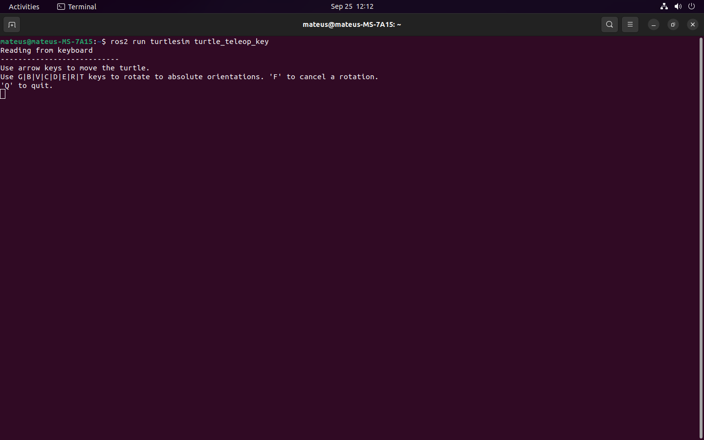
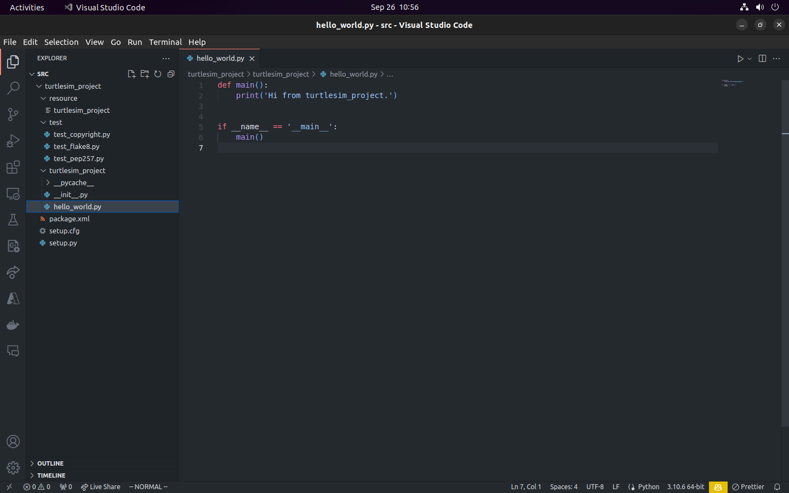
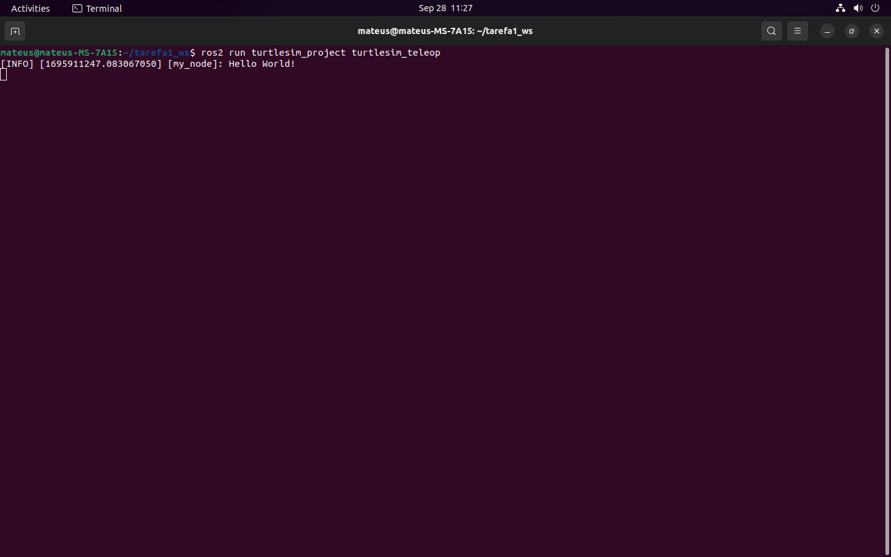
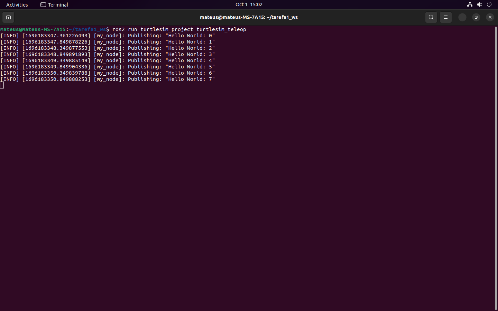

# Instalando o Turtlesim

Nesse primeiro projeto nós assumimos que você já possui o ROS2 instalado no seu computador. Para começar vamos instalar o Turtlesim, que é um simulador simples criado para aprender ROS2.

O Turtlesim pode ser instalado com os seguintes comandos:

```
sudo apt update
sudo apt install ros-humble-turtlesim
```

Para confirmar que tudo está correto execute esse comando:

```
ros2 pkg executables turtlesim
```

A saída deve ser algo assim:
```
turtlesim draw_square
turtlesim mimic
turtlesim turtle_teleop_key
turtlesim turtlesim_node
```


# Motivação 

Completando esse projeto com o turtlesim você vai aprender os conceito básicos do ROS2. Esses conceitos serão usados em projetos mais complexos que serão desenvolvidos ao longo dos projetos nesse repositório.

# Tarefa 1: Introdução Turtlesim 🐢

## Parte 1 : Rodar o turtlesim

O turtlesim é um simulador simples criado para aprender ROS2 e para se familiarizar com ele você pode começar executando esse comando:

```
ros2 run turtlesim turtlesim_node
```

Você deverá vem uma janela como essa:


Como vocês podem ver é uma simples janela com fundo azul e uma tartaruga no centro, sem muito o que fazer por enquanto.

## Parte 2 : Usar o comando do teleop_key para movimentar a tartaruga

Agora que você já tem o turtlesim rodando, você pode usar o comando do teleop_key para movimentar a tartaruga. Para isso abra um novo terminal e execute o seguinte comando:

```
ros2 run turtlesim turtle_teleop_key
```

Você deverá ver uma saída como essa:



Experimente usar as teclas para movimentar a tartaruga e veja o que acontece.

## Conclusão

Tá bom, muito legal uma tartaruga andando em uma simples janela, mas o que isso tem a ver com robôtica? Você ainda pode não saber, mas a mesma estrutura que você acaba de usar para controlar essa tartaruga foi usada de diversas maneira para controlar esse robozinho aqui:


Esse robô se chama **Robonaut**, e foi construido pela **NASA** utilizando **ROS2**. Nessa foto ele está na Estação Espacial Internacional (ISS) e é controlado por astronautas da NASA. Ele é capaz de realizar diversas tarefas na ISS, como por exemplo, trocar baterias e realizar experimentos científicos. Se você quiser ler mais sobre o Robonaut ou sobre ROS2 no espaço, você pode acessar esse link: [ROS…in…space!](https://www.openrobotics.org/blog/2022/2/2/rosinspace)


# Tarefa 2: Nodes no ROS2

## Parte 1: Criando um novo pacote

Nesta tarefa, iremos desenvolver nosso próprio nó para controlar uma tartaruga. No entanto, antes de começarmos, precisamos configurar um ambiente chamado 'workspace'. Mas afinal, o que é um 'workspace'? Em termos simples, um 'workspace' é um diretório que contém todos os pacotes necessários para um projeto específico. É como um espaço de trabalho dedicado para sua aplicação ROS2.

Para criar um novo pacote dentro do nosso 'workspace', utilizaremos o comando `ros2 pkg create`. Este comando nos permite criar um novo pacote, que é uma unidade organizacional fundamental no ROS2. Os pacotes são responsáveis por conter código, bibliotecas, recursos e outros elementos necessários para realizar tarefas específicas dentro de um sistema. Com a criação deste pacote, estaremos preparados para começar a desenvolver nosso próprio nó e, assim, iniciar o controle da tartaruga.

Mas antes de criarmos o pacote, vamos primeiro ver a estrutura básica de uma "workspace" do ROS2. A estrutura é a seguinte:

```
tarefa1_ws/
    build/
    install/
    src/
```

Onde "tarefa1_ws" é o nome do nosso workspace. O diretório "src" contém todos os pacotes ROS2 necessários para o nosso projeto. O diretório "build" contém todos os arquivos de compilação gerados durante o processo de compilação. O diretório "install" contém todos os arquivos de instalação gerados durante o processo de instalação. Veremos o que é esse processo de compilação e instalação mais tarde. O que você precisar criar agora é o diretório "tarefa1_ws" e o diretório "src" dentro dele. Estão vamos lá, abra um terminal e execute os seguintes comandos:

```
mkdir -p tarefa1_ws/src
```

Com isso pronto entre **dentro** do diretório "src" e execute o seguinte comando:

```
ros2 pkg create --build-type ament_python --node-name hello_world turtlesim_project
```

Agorar vamos ver o que cada parte desse comando significa:

- **ros2 pkg create**: comando para criar um novo pacote
- **--build-type ament_python**: define o tipo de pacote que estamos criando, neste caso um pacote em python
- **--node-name hello_world**: define o nome do nó que estamos criando, neste caso o nome do nó é hello_world
- **turtlesim_project**: define o nome do pacote que estamos criando, neste caso o nome do pacote é turtlesim_project

Se tudo deu certo você terá uma estrutura de diretorios como essa:



## Parte 2: Criando um node

### Afinal, o que é um node?


Um node no ROS2 é algo parecido com uma função, porque ele deve ser modular e responsável apenas por uma ação específica. Por exemplo, imagine que estamos desenvolvendo um robô que deve ser capaz de se mover e de reconhecer objetos. Nesse caso, podemos ter dois nodes, um para controlar o movimento do robô e outro para reconhecer objetos. Esses nodes podem ser executados em paralelo e se comunicar entre si para realizar tarefas mais complexas. É óbvio que esse exemplo é muito simples, e em uma aplicação real teríamos muito mais nodes, mas a ideia é essa.


Os nodes se comunicam entre si usando tópicos e serviços. Vamos falar mais sobre isso mais tarde, mas por enquanto vamos focar em criar nosso primeiro node.

### Estrutura de um node

Para começarmos crie um arquivo chamado "turtlesim_teleop.py" dentro do diretório "turtlesim_project/turtlesim_project" e adicione o seguinte código:

```python
import rclpy
from rclpy.node import Node

class MyNode(Node):
    def __init__(self):
        super().__init__('my_node')
        self.get_logger().info("Hello World!")

def main(args=None):
    rclpy.init(args=args)
    node = MyNode()
    rclpy.spin(node)
    node.destroy_node()
    rclpy.shutdown()

if __name__ == '__main__':
    main()
```

Essa é a estrutura básica de um node em python. Vamos explicar agora as partes mais importantes desse código.

```python
import rclpy
from rclpy.node import Node
```

`import rclpy`: Esta linha importa o módulo rclpy. rclpy é a biblioteca do cliente Python para o ROS2. Ela fornece as ferramentas necessárias para criar e executar nodes usando Python.

`from rclpy.node import Node`: Esta linha importa a classe Node do módulo rclpy.node. A classe Node é uma classe fundamental no ROS2 que representa um node.

```python
class MyNode(Node):
    def __init__(self):
        super().__init__('my_node')
        self.get_logger().info("Hello World!")
```

Este trecho de código define uma classe chamada `MyNode` que herda da classe `Node` do ROS2. Aqui está o que cada linha faz:

- `class MyNode(Node)`: Esta linha define uma nova classe chamada `MyNode` que herda de `Node`. A classe `Node` é uma classe fundamental no ROS2 que representa um nó.

- `def __init__(self)`: Esta linha define o método construtor para a classe `MyNode`. Este método é chamado automaticamente quando você cria uma nova instância da classe.

- `super().__init__('my_node')`: Esta linha chama o método construtor da classe pai (`Node`) usando a função `super()`. Isso permite que você use os métodos e atributos da classe pai na sua subclasse. O argumento `'my_node'` é o nome do nó e é passado para o construtor da classe pai.

- `self.get_logger().info("Hello World!")`:  Esta linha usa o método `get_logger()` para obter o logger associado a este nó. O logger é usado para registrar mensagens de log. O método `info()` é usado para registrar uma mensagem de informação. Neste caso, ele registra a mensagem "Hello World!".


```python
def main(args=None):
    rclpy.init(args=args)
    node = MyNode()
    rclpy.spin(node)
    node.destroy_node()
    rclpy.shutdown()
```
Aqui está o que cada linha faz:

- `rclpy.init(args=args)`: Esta linha inicializa o sistema de comunicação do ROS. Isso deve ser chamado antes de usar qualquer outra parte do rclpy. Geralmente, passamos os argumentos da linha de comando para esta função, que são usados para configurações do ROS (como definir variáveis de ambiente ROS).

- `node = MyNode()`: Aqui estamos criando uma instância da classe MyNode.

- `rclpy.spin(node)`: Esta função faz com que o programa entre em um loop, processando callbacks sempre que as mensagens são recebidas nos **tópicos** aos quais o nó está inscrito, ou quando os serviços fornecidos pelo nó são chamados. O loop continua até que seja interrompido (por exemplo, se você pressionar Ctrl+C).

- `node.destroy_node()`: Depois que o loop é interrompido, esta linha é chamada para limpar os recursos associados ao nó.

- `rclpy.shutdown()`: Finalmente, esta linha desliga o sistema de comunicação do ROS, liberando quaisquer recursos que ele estava usando.

### Executando o node

Vamos executar essa estrutura básica de node para ver o que acontece. Para isso abra um novo terminal e vá até o diretório "tarefa1_ws" e execute o seguinte comando:

```
colcon build
```

O comando acima serve para compilar o pacote que acabamos de criar. Agora execute o seguinte comando:

```
source install/setup.bash
```

Esse comando serve para configurar o ambiente para que o ROS2 possa encontrar o pacote que acabamos de criar. E por fim execute o seguinte comando:

```
ros2 run turtlesim_project turtlesim_teleop
```

Agora você deve ver uma saída como essa:



Agora o nosso node está rodando e você pode ver a mensagem "Hello World!" sendo impressa no terminal. Em outro terminal você pode executar o comando `ros2 node list` para ver os nodes que estão rodando. Se você ver o node "my_node" na lista, significa que tudo deu certo.

Para ler mais sobre nodes você pode acessar esse link: [ROS2 Nodes](https://docs.ros.org/en/humble/Tutorials/Beginner-CLI-Tools/Understanding-ROS2-Nodes/Understanding-ROS2-Nodes.html)

# Tarefa 3: Criando um publisher

Agora nós vamos modificar o nosso node para publicar uma mensagem, um node que publica mensagens é chamado comumente de publisher. O publisher publica mensagens em um tópico, e outros nodes podem se inscrever nesse tópico para receber essas mensagens.

### Mas o que é exatamente um tópico? Vamos responder usando uma analogia com Star Wars 🌌🔫

Imagine que os tópicos são como canais de comunicação entre diferentes naves, planetas ou bases da galáxia. Cada tópico tem um nome único e um tipo de mensagem que define o formato dos dados que são enviados ou recebidos. Por exemplo, o tópico /rebelion pode usar mensagens do tipo string para transmitir mensagens secretas entre os membros da Aliança Rebelde.

Os nós são como os dispositivos ou pessoas que usam esses canais de comunicação para trocar informações. Cada nó pode publicar (enviar) ou subscrever (receber) em um ou mais tópicos, dependendo da sua função e interesse. Por exemplo, o nó /luke pode publicar no tópico /force para enviar sinais da Força para outros Jedi, e subscrever no tópico /rebelion para receber instruções da Aliança Rebelde.

Os publicadores e assinantes não precisam saber da existência uns dos outros, apenas do nome e tipo do tópico que usam. Isso permite uma comunicação assíncrona e flexível entre os nós, sem depender de uma conexão direta ou de uma ordem específica. Por exemplo, o nó /leia pode publicar uma mensagem de socorro no tópico /rebelion, sem saber quem vai recebê-la ou quando. O nó /han pode subscrever esse tópico e responder à mensagem, sem saber quem a enviou ou de onde.


Essa estrutura distribuída do ROS 2 é muito importante, porque no seu antecessor ROS 1, existia um mestre central que coordenava todas as atividades dos nodes. Isso significa que todos os nodes dependiam desse mestre para se comunicar uns com os outros. No entanto, no ROS 2, cada node é independente e pode se comunicar diretamente com os outros nodes através dos tópicos. Isso torna o sistema mais robusto e escalável, pois não há um único ponto de falha.

Você pode ler mais sobre tópicos aqui: [ROS2 Topics](https://docs.ros.org/en/humble/Tutorials/Beginner-CLI-Tools/Understanding-ROS2-Topics/Understanding-ROS2-Topics.html)


## Parte 1: Mão na massa

Abra o arquivo "turtlesim_teleop.py" no seu editor de código de preferência e vamos começar alterando a classe "MyNode" para que ela publique mensagens no tópico "/my_first_topic". A primeira coisa que vamos precisar é adicionar essas linhas no construtor da classe.

```python
 def __init__(self):
        super().__init__('my_node')
        self.publisher_ = self.create_publisher(String, 'my_first_topic', 10)
        timer_period = 0.5 
        self.timer = self.create_timer(timer_period, self.timer_callback)
        self.i = 0
```

O construtor da classe está criando um publicador que envia mensagens do tipo String para o tópico "my_first_topic". Ele também está criando um timer que chama a função "timer_callback" a cada 0.5 segundos. Vamos criar a função "timer_callback" mais adiante. 

Para a linha `self.publisher_ = self.create_publisher(String, 'my_first_topic', 10)` vamos explicar o que cada parte significa:

- `self.publisher_`: Esta é uma variável de instância que armazena o publicador que você está criando. O uso de um sublinhado no final (_) é uma convenção comum em Python para indicar que esta variável é destinada a uso interno dentro da classe e não deve ser acessada diretamente.

- `self.create_publisher`: Este é um método fornecido pela classe Node em ROS2. Ele cria um publicador que pode enviar mensagens a um tópico.

- `String`: Este é o tipo de mensagem que o publicador irá enviar. Neste caso, ele está configurado para enviar mensagens do tipo String.

- `'my_first_topic'`: Este é o nome do tópico ao qual o publicador enviará mensagens. Você pode escolher qualquer nome que quiser, desde que seja único dentro do seu sistema ROS.

- `10`: Este é o tamanho da fila de mensagens para o publicador. Se o publicador estiver enviando mensagens mais rápido do que elas podem ser processadas, ele armazenará até 10 mensagens nesta fila. Isso se chama QoS (Quality of Service) e não é muito importante para nós agora, mas você pode ler mais sobre isso aqui: [ROS2 QoS](https://docs.ros.org/en/humble/Tutorials/Quality-of-Service.html)

Também é nessário adicionar o import da classe String no início do arquivo:

```python
    ...
    from std_msgs.msg import String
    ...
```

Agora vamos criar a função "timer_callback" que será chamada a cada 0.5 segundos.

```python
 def timer_callback(self):
        msg = String()
        msg.data = 'Hello World: %d' % self.i
        self.publisher_.publish(msg)
        self.get_logger().info('Publishing: "%s"' % msg.data)
        self.i += 1
```

Essa função cria uma mensagem do tipo String, define o valor da mensagem e publica a mensagem no tópico "my_first_topic". A função também registra uma mensagem de log para informar que a mensagem foi publicada. A parte mais interessante dessa função é a linha `self.publisher_.publish(msg)` que usa o publicador que criamos anteriormente para publicar a mensagem no tópico "my_first_topic".


Pronto, você já criou seu primeiro publisher. Agora vamos compilar o pacote e executar o node para ver o que acontece. Mas agora vamos fazer isso utilizando o comando `colcon build --symlink-install`. Esse comando serve para criar um link simbólico para o pacote que estamos desenvolvendo. Isso significa que se você alterar o código do pacote, não será necessário compilar novamente para que as alterações sejam aplicadas. Na pasta "tarefa1_ws" execute o seguinte comando:

```
colcon build --symlink-install
```

Agora rode o node com o seguinte comando:

```
ros2 run turtlesim_project turtlesim_teleop 
```

Você deverá ver uma saída como essa:




Já que falamos de Star Wars aqui, vou sugerir um exercícios simples para vocês. Crie um node chamado /chewbacca que publica mensagens do tipo String no tópico /wookie_sounds. Seja criativo e tente transcrever os sons que o Chewbacca faz em texto.

E agora que você já criou um publisher, que tal criar um subscriber? Vamos lá!

# Tarefa 4: Criando um subscriber

Agora vamos criar um novo arquivo chamado "turtlesim_subscriber.py" dentro do diretório "turtlesim_project/turtlesim_project". Antes de começarmos a escrever o código, tente você mesmo criar um subscriber que se inscreve no tópico "my_first_topic" e imprime as mensagens recebidas. Se você não conseguir, não se preocupe, vamos fazer isso juntos agora.

Copie e cole o código que você escreveu no arquivo "turtlesim_teleop.py" para o arquivo "turtlesim_subscriber.py". Agora vamos alterar o construtor da classe "MyNode" para que ela se inscreva no tópico "my_first_topic". O construtor da classe deve ficar assim:

```python
class MyNode(Node):
    def __init__(self):
        super().__init__('my_node')
        self.subscriber = self.create_subscription(String, 'my_first_topic', self.subscriber_callback, 10)
```

Ao criar um subscriber passamos os mesmos parâmetros que passamos para o publisher, com exceção da mensagem que é recebida e da função que é chamada quando uma mensagem é recebida. A função "subscriber_callback" será chamada sempre que uma mensagem for recebida no tópico "my_first_topic". Agora vamos criar essa função:


```python
def subscriber_callback(self, msg):
        print('I heard: [%s]' % msg.data)
```

Simples, não é? Você pode apagar a função "timer_callback" que criamos anteriormente, pois não vamos mais usá-la nesse arquivo. Agora vamos compilar o pacote e executar o node para ver o que acontece. Execute o processo de compilação como visto anteriormente.

Após compilar o pacote, execute o seguinte comando para executar o node:

```
ros2 run turtlesim_project turtlesim_subscriber 
```

Deu certo? Não? Você deve ter visto uma mensagem reclamando de `no executable found` ou algo relacionado a `importlib_load_entry_point`.

Isso aconteceu porque o ROS2 não sabe que o arquivo "turtlesim_subscriber.py" é um node. Para resolver isso, vamos alterar o arquivo "setup.py".

## Arquivo setup.py

O arquivo `setup.py` é usado para configurar a instalação de pacotes Python, incluindo ROS2. Os "entry points" são uma característica desse arquivo que permite a criação de comandos de terminal a partir de funções Python. No ROS2, eles são usados para expor nós e comandos para outros pacotes.

Pense no arquivo setup.py como o manual de instruções para montar um brinquedo de blocos. Ele diz ao Python (o montador) como montar e onde colocar cada peça (os módulos e scripts do pacote).

Os “entry points” são como as portas especiais que você coloca em sua construção. Eles permitem que outras pessoas (outros pacotes) interajam com sua construção de maneiras específicas, como abrir uma porta para ver dentro ou usar um comando para ativar uma função.

Agora vamos criar um `entry point` para o nosso node adicionando a seguinte linha no arquivo "setup.py":

```python 
    ...
    entry_points={
        'console_scripts': [
            'turtlesim_teleop = turtlesim_project.turtlesim_teleop:main',
            'turtlesim_subscriber = turtlesim_project.turlesim_subscriber:main',
        ],
    },
    ...
```


# Tarefa 3: Mensagens Personalizadas no ROS2

Objetivo: Introduzir mensagens personalizadas no ROS2.
Passos:
Definir uma mensagem personalizada para enviar informações de posição da tartaruga.
Modificar os nós para publicar e assinar essas mensagens personalizadas.

# Tarefa 4: Serviços no ROS2

Objetivo: Ensinar o uso de serviços para tarefas síncronas no ROS2.
Passos:
Criar um serviço que permita ao usuário definir a posição desejada da tartaruga.
Modificar um nó para usar esse serviço para mover a tartaruga para uma posição específica.

# Tarefa 5: Ações no ROS2

Objetivo: Introduzir ações para tarefas assíncronas no ROS2.
Passos:
Criar uma ação que permita ao usuário definir um objetivo de movimento para a tartaruga.
Criar um nó que execute ações para mover a tartaruga de acordo com o objetivo.

# Tarefa Final: Combinação de Tarefas

Objetivo: Criar uma aplicação mais complexa que utiliza todos os conceitos aprendidos.
Passos:
Crie um cenário onde a tartaruga deve seguir um caminho predefinido (usando serviços).
Ao longo do caminho, a tartaruga deve evitar obstáculos (usando ações).
Lembre-se de fornecer explicações detalhadas, exemplos de código e exercícios práticos para os alunos em cada tarefa. Certifique-se também de incluir desafios opcionais para alunos mais avançados e de incentivar a experimentação e a resolução de problemas. Ao final do curso, os alunos devem ter um entendimento sólido dos conceitos básicos do ROS2 e como aplicá-los usando o Turtlesim.
